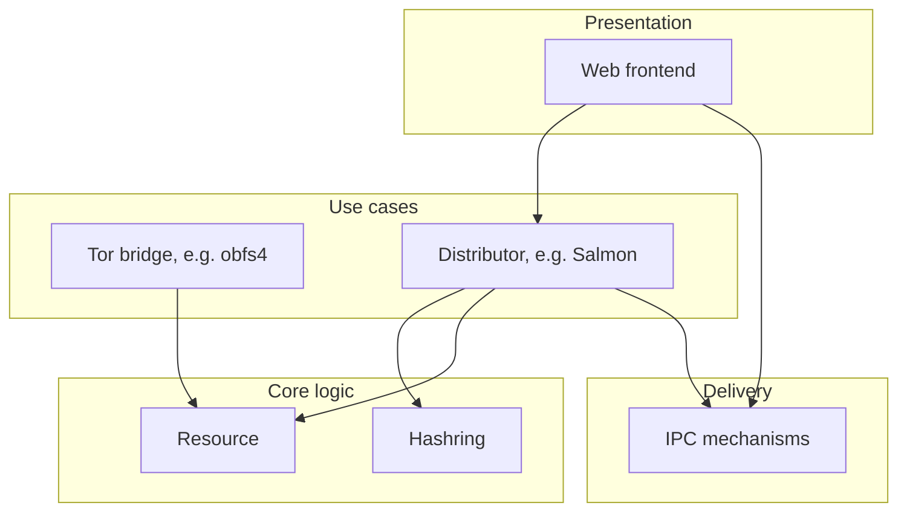
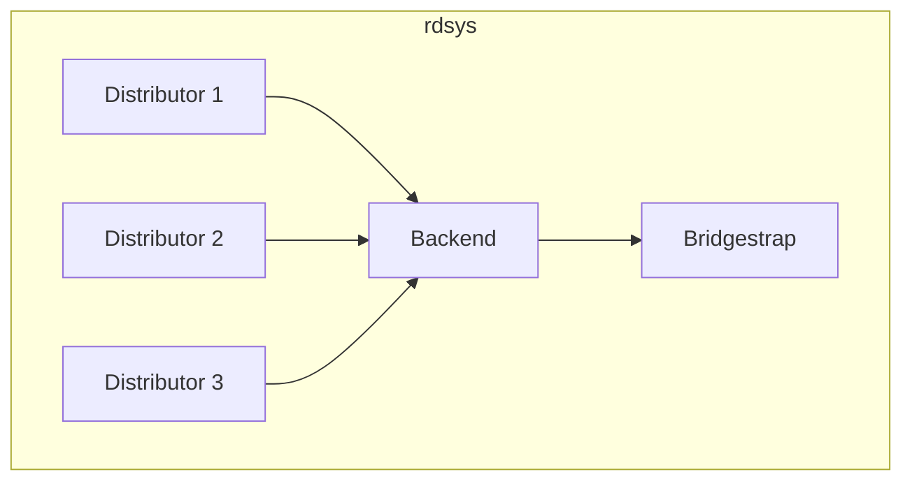

Design and architecture
=======================

If you are new to rdsys and seek to understand its design and architecture, this
document is for you.  It helps you understand rdsys's information flow, its
layers of abstraction, and how the code is organised.

Layers of abstraction
---------------------

Rdsys aspires to implement the design philosophy of [The Clean
Architecture](https://blog.cleancoder.com/uncle-bob/2012/08/13/the-clean-architecture.html).
Applied to our domain of circumvention proxy distribution, this means the
following:

At the lowest layer, we have rdsys's *domain logic*.  These are abstract
building blocks that implement rdsys's "axioms".  An example is the notion of a
*resource* – a "thing" that rdsys hands out to users.  This can be a Tor bridge,
a VPN proxy, a Snowflake proxy, or download links for circumvention software.
In Go, a resource is an interface (it's called `Resource` and is defined in
[domain.go](https://gitlab.torproject.org/tpo/anti-censorship/rdsys/-/blob/master/pkg/core/domain.go)),
which dictates what methods an object has to implement.

On top of the domain logic are *use cases*.  These are actually useful
manifestations of the building blogs in the domain logic.  An abstract resource
turns into a Tor bridge – a concrete "thing" that we can hand out to users.
Distributors are a different kind of use case because they turn the abstract
idea of hashrings into code that actually hands out things to users.

Rdsys's processes talk to each other via a *delivery mechanism* – currently
implemented as HTTP connections but this could also be domain sockets, or remote
procedure calls.  The Go interface `Mechanism` (defined in
[ipc.go](https://gitlab.torproject.org/tpo/anti-censorship/rdsys/-/blob/master/pkg/delivery/ipc.go))
specifies the methods that a delivery mechanism must implement.

Finally, there's the *presentation* layer, which implements the user interfaces
that users interact with.  An example is a Web page that allows users to request
resources.  The presentation layer wraps the distributor code in the use cases
layer.

It is important to understand that software dependencies *only point downwards*
in the abstraction layers: The presentation layer uses code that's part of the
delivery and use cases layer but the use cases layer *must not* use code that's
in the presentation layer.  This principle keeps the code reasonably easy to
maintain and allows for drop-in replacements of, say, the delivery layer.

The following diagram illustrates a simplification of the relationships
discussed above.  The black arrows denote dependencies.  Note how all
dependencies only point downwards.

Software architecture
---------------------

Rdsys implements a microservice-based architecture and consists of one backend
process and several distributor processes.  The distributors talk to the backend
over an HTTP streaming API.  The backend exposes two APIs and one Web page:

1. A public API that lets resources register themselves.
2. A private API that supplies distributors with resources.
3. A Web page that shows the status of specific resources.

To test resources (or more specifically: Tor bridges), rdsys relies on
[bridgestrap](https://gitlab.torproject.org/tpo/anti-censorship/bridgestrap).

Information flow
----------------

This subsection discusses how a resource goes from being added to rdsys to being
handed out to users.

1. A resource can make it into rdsys in two ways:

   1.1 By being passively pulled by rdsys (see
       [kraken.go](https://gitlab.torproject.org/tpo/anti-censorship/rdsys/-/blob/master/internal/kraken.go)).
       An example are Tor bridge descriptors, which rdsys parses periodically.

   1.2 By actively registering itself.  Resources can send an HTTP GET request
       to rdsys to register themselves for distribution (see
       [backend.go](https://gitlab.torproject.org/tpo/anti-censorship/rdsys/-/blob/master/internal/backend.go).
       An example are [Snowflakes proxies](https://snowflake.torproject.org) –
       at least in theory because Snowflakes are stand-alone proxies without a
       Tor process that would take care of "publishing" a resource.

2. Once a resource is in rdsys's backend, it's ready to be handed out to a
   distributor because the backend does not handle resource distribution.  Each
   resource maps to one – and only one – distributor.

3. Distributors obtain resources from rdsys's backend by talking to an HTTP API.
   This API provides distributors with an initial, deterministically-selected
   set of resources, followed by resource updates, which are sent whenever the
   set of resources changes, i.e. resources disappear, change, or are added.

4. The distribution of resources is at the discretion of distributors.  It is
   the distributor's responsibility to 1) smartly hand out resources to users,
   2) implement intuitive UIs, and 3) thwart Sybil attacks.

Directory structure
-------------------

Here is an overview of rdsys's directory structure and the purpose of each
directory.

* bin/ 
* cmd/ (Command line tools that invoke the backend and distributors.)
* conf/ (Rdsys's configuration file.)
* doc/ (Documentation, e.g. the document you are reading right now.)
* internal/ (code that's internal to rdsys)
* pkg/ (code that can be reused by other projects)
  - core/ (Rdsys's elementary building blocks; the lowest layer of abstraction.)
  - usecases/ (Use cases that emerge from the building blocks, e.g. resources and distributors.)
  - delivery/ (Rdsys's IPC mechanisms.)
  - presentation/ (The user-facing frontends for distributors.)

If you are new to rdsys's code base, it's best to work your way up the layers
of abstraction.  Read the code in the following order:

1. pkg/core/
2. pkg/usecases/
3. pkg/delivery/
4. pkg/presentation/
